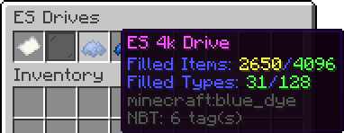
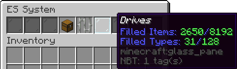
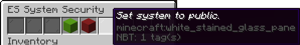
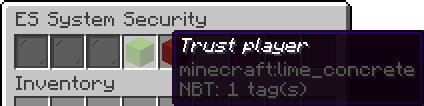
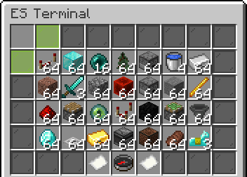
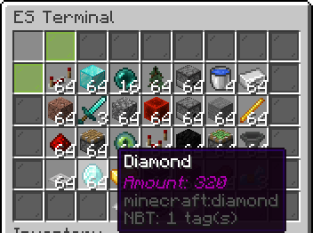

<h1 align="center">Energetic Storage</h1>
<p align="center">
Applied Energistics 2 for your SpigotMC server
</p>

Energetic Storage is a plugin that is heavily inspired by a forge mod named, [Applied Energistics 2](https://www.curseforge.com/minecraft/mc-mods/applied-energistics-2). If you dont know what Applied Energistics 2 is, its a mod that allows the player to store large amounts of items, sometimes hundreds of thousands, in just a few blocks. If you run into any issues, [create a GitHub issue!](https://github.com/SeanOMik/EnergeticStorage/issues/new) 

Features:
* Hopper Input
* Terminal Sorting
* Player Whitelist
* Terminal searching
* Balanced
* Supports 1.14.X-1.18.X

## Items And Blocks:
* 1k, 4k, 16k, and 64k, drives
    * The drives are needed to store items. 1k can store 1024 items, 4k can store 4096 and so on (1024 * how many thousand).
    * All drives have a type limit set at 128. This means that only 128 different item types can be added to a single drive.
        * Can be changed in config. 
* ES System
    * The ES System is what keeps the drives inside of it and is used to access the items stored on the drives.
    * You can trust players into the system, they will have just as much access as you do.
        * Only the system owner can trust players.
    * Public ES Systems:
        * **_Anybody_** will have access to take items from the system.
        * Only trusted players and the owner of the system can destroy it.
        
## Permissions
* `energeticstorage.*`: Gives all Energetic Storage permissions. Default: `op`
* `energeticstorage.reload`: Gives permission to reload the Energetic Storage configuration files. Default: `op`
* `energeticstorage.esgive`: Gives permission to give an Energetic Storage item to themselves. Default: `op`
* `energeticstorage.esgive.others`: Gives permission to give an Energetic Storage item to others. Default: `op`
* `energeticstorage.system.open.untrusted`: Gives permission to open an ES System that the player is not trusted on. Default: `op`
* `energeticstorage.system.create`: Gives permission to create an ES System. Default: `Everyone`
* `energeticstorage.system.destroy.untrusted`: Gives permission to destroy a system the player isn't trusted on. Default: `op`

## Commands
* /esreload
* /esgive [drive/system] [1k, 4k, 16k, 64k] (player)

## Config:
Config.yml:
```yaml
driveMaxTypes: 128 # Sets the drives max type limit.
```

Players.yml is where **_all_** player data is stored. **I would recommend not messing with this file as it will likely cause errors and item loss!**

## Screenshots










;
